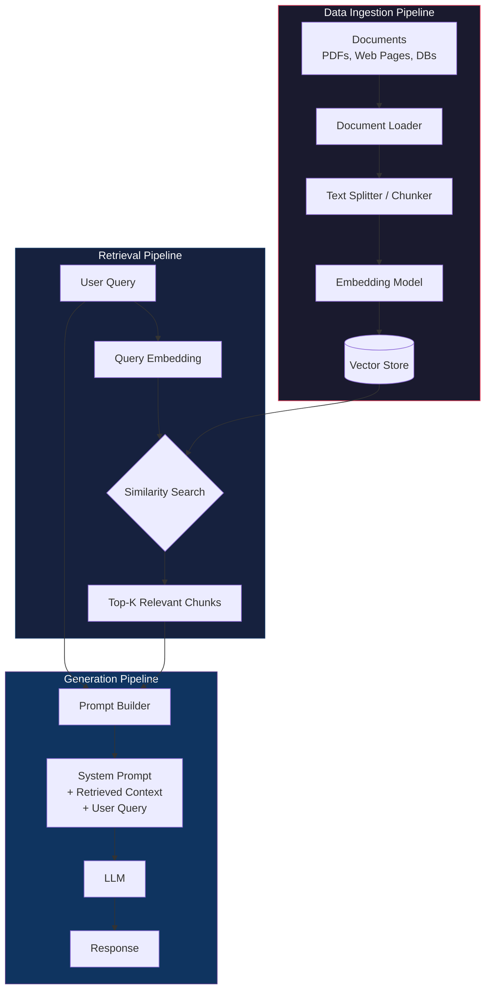
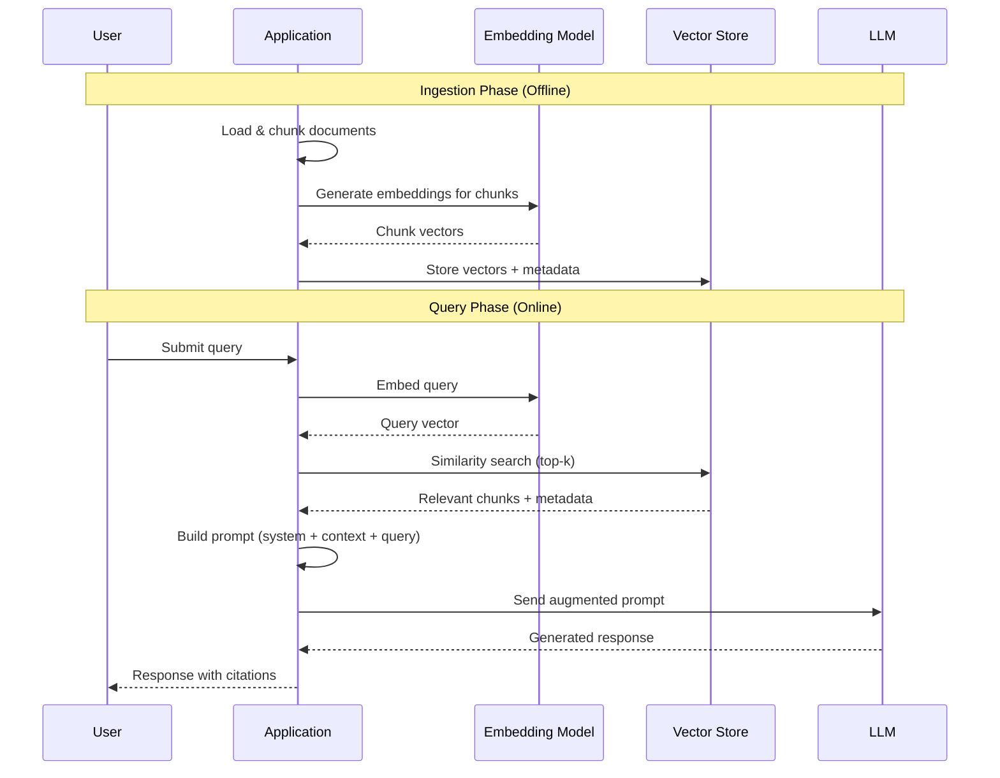

# RAG (Retrieval-Augmented Generation) Architecture

## High-Level Overview

## Detailed Component Diagram

```mermaid
flowchart LR
    subgraph Sources["Data Sources"]
        S1[PDFs]
        S2[Web Pages]
        S3[Databases]
        S4[APIs]
        S5[Text Files]
    end

    subgraph Processing["Document Processing"]
        P1[Document Loader\nLangChain / LlamaIndex]
        P2[Text Splitter\nRecursive, Token-based]
        P3[Metadata Extraction\nSource, Date, Title]
    end

    subgraph Embedding["Embedding"]
        E1[Embedding Model\nOpenAI / Cohere / HuggingFace]
        E2[Vector Representations\n768-3072 dimensions]
    end

    subgraph Storage["Vector Storage (pick one)"]
        V1[(Pinecone)]
        V2[(ChromaDB)]
        V3[(FAISS)]
        V4[(Weaviate)]
    end

    subgraph Query["Query Pipeline"]
        Q1[User Query]
        Q2[Query Embedding]
        Q3[Similarity Search\nCosine / Dot Product]
        Q4[Re-Ranker\nCross-Encoder]
        Q5[Top-K Chunks]
    end

    subgraph LLM["LLM Generation"]
        L1[Prompt Template]
        L2[Context Window Assembly]
        L3[LLM\nClaude / GPT / Llama]
        L4[Generated Response]
        L5[Citation Extraction]
    end

    Sources --> P1 --> P2 --> P3 --> E1 --> E2 --> Storage
    Q1 --> Q2 --> Q3 --> Q4 --> Q5
    Storage --> Q3
    Q5 --> L1
    Q1 --> L1
    L1 --> L2 --> L3 --> L4 --> L5
```

## Sequence Diagram

## Key Components

| Component | Purpose | Examples |
| --------- | ------- | -------- |
| Document Loader | Ingest raw data from various sources | LangChain loaders, LlamaIndex readers |
| Text Splitter | Break documents into retrievable chunks | Recursive character, token-based, semantic |
| Embedding Model | Convert text to dense vector representations | OpenAI `text-embedding-3-small`, Cohere Embed |
| Vector Store | Index and search embeddings efficiently | Pinecone, ChromaDB, FAISS, Weaviate |
| Retriever | Find relevant chunks for a query | Similarity search, MMR, hybrid search |
| Re-Ranker | Reorder results by relevance | Cross-encoders, Cohere Rerank |
| LLM | Generate final answer from context + query | Claude, GPT-4, Llama |

## Design Considerations

- **Chunk Size**: 256-1024 tokens balances context preservation vs retrieval precision
- **Overlap**: 10-20% overlap between chunks prevents losing context at boundaries
- **Top-K**: Retrieve 3-10 chunks depending on context window size
- **Hybrid Search**: Combine dense (vector) + sparse (BM25) retrieval for better recall
- **Guardrails**: Validate that the LLM response is grounded in retrieved context
