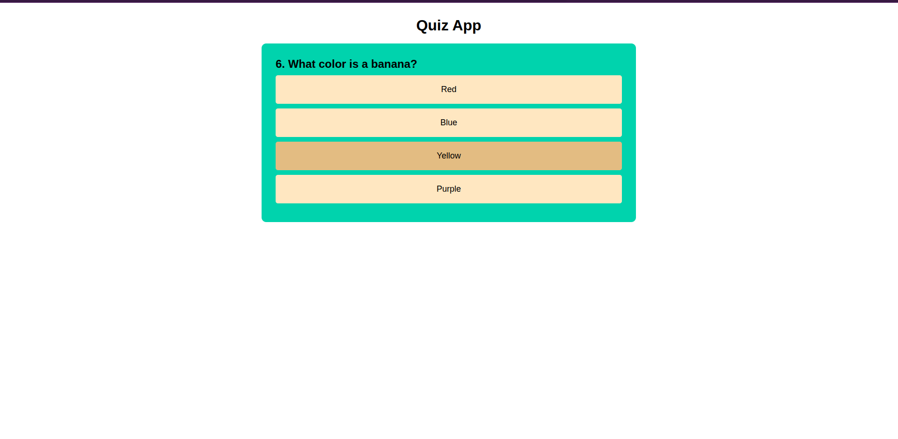
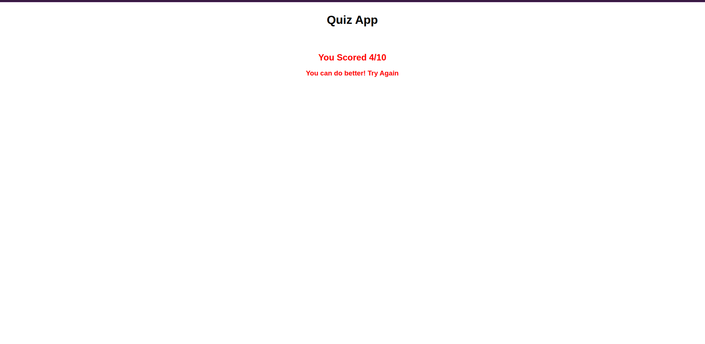

### TASK 2 - Dynamic Quiz Application

**Objective:** 
Build a quiz app that dynamically loads questions and tracks user scores.
**Requirements:**
- Store quiz questions and options in a JavaScript object or load them from an external JSON file.
- Use event listeners to capture user selections and move through quiz questions.
- Calculate and display the final score, providing feedback or explanations as needed.
 
**Output**

