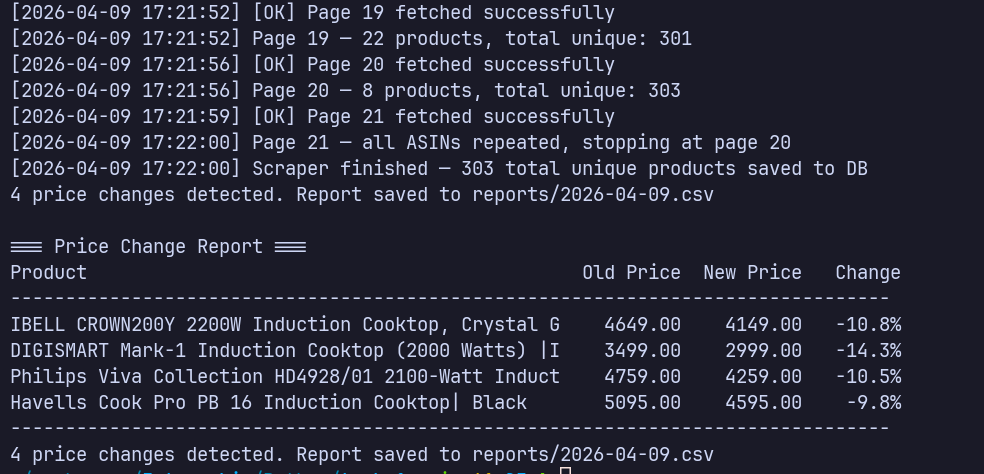
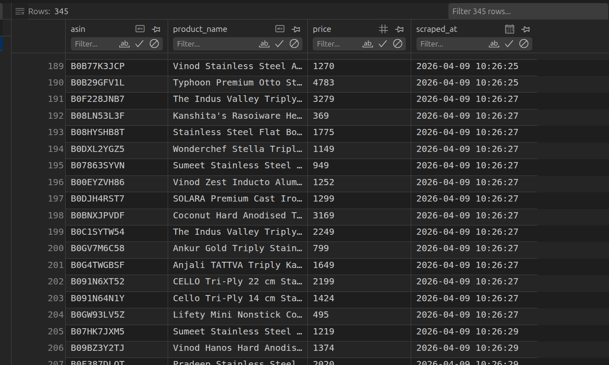

### Task 1 — Web Scraper with Anti-Bot Bypass

Scrapes Amazon.in product listings nightly, stores prices in SQLite, and generates a daily CSV report flagging price changes.

### Output

Products stored in db


## What it does

- Fetches all pages of a search query using a headless Chromium browser
- Rotates User-Agents and adds random delays to avoid bot detection
- Retries failed requests up to 3 times before skipping
- Detects the last page automatically by tracking duplicate ASINs
- Stores product name, ASIN, and price per day - no duplicates
- Compares today's prices against yesterday's and exports a change report
- Logs all activity with timestamps to `scraper.log`

## Setup and Usage

```bash
python3 -m venv venv
source venv/bin/activate
pip install -r requirements.txt
playwright install chromium
```
```bash
python3 main.py
```
## Schedule (nightly)

```bash
crontab -e
```
and type this
```
0 2 * * * cd <replace with ur path> && venv/bin/python3 main.py >> scraper.log 2>&1
```
