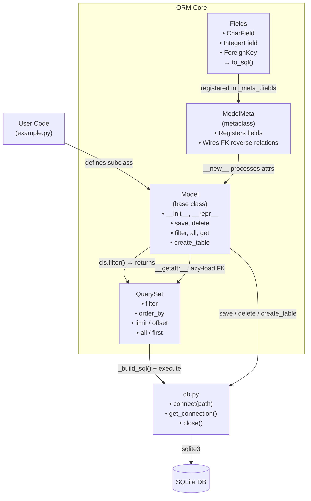

# Custom ORM (Object-Relational Mapper)

A lightweight ORM built from scratch in Python using metaclasses and descriptors. Supports model definition, field validation, query building, relationships, and lazy loading — all backed by SQLite.

---

## Architecture



---

## Project Structure

```
task-3-oc/
├── db.py         # SQLite connection management
├── fields.py     # Field types: CharField, IntegerField, ForeignKey
├── model.py      # ModelMeta metaclass + Model base class
├── query.py      # QuerySet — chainable query builder
├── __init__.py   # Public API exports
└── example.py    # Usage demonstration
```

---

## How It Works

### 1. Field Types (`fields.py`)

Fields describe column types and constraints. Each field knows how to render itself as a SQL fragment via `to_sql()`.

| Field | SQL Type | Options |
|-------|----------|---------|
| `CharField(max_length=N)` | `VARCHAR(N)` | `nullable`, `unique` |
| `IntegerField()` | `INTEGER` | `nullable`, `unique` |
| `ForeignKey(Model)` | `INTEGER REFERENCES ...` | `related_name`, `on_delete` |

### 2. Metaclass (`ModelMeta` in `model.py`)

When you define a subclass of `Model`, `ModelMeta.__new__` runs at class creation time and:
- Collects all `Field` instances into `cls._meta_.fields`
- Derives the table name from the class name (lowercased)
- For each `ForeignKey`, attaches a reverse-relation `property` onto the referenced model

### 3. Model (`model.py`)

The `Model` base class provides:

| Method | Description |
|--------|-------------|
| `Model.create_table()` | Emits `CREATE TABLE IF NOT EXISTS` SQL |
| `instance.save()` | `INSERT` if new, `UPDATE` if existing (tracks `id`) |
| `instance.delete()` | `DELETE WHERE id = ?` and clears `self.id` |
| `Model.filter(**kwargs)` | Returns a `QuerySet` with WHERE clauses |
| `Model.all()` | Returns all rows as model instances |
| `Model.get(**kwargs)` | Returns first matching instance or `None` |
| `instance.fk_field` | Lazy-loads the related object on access |

### 4. QuerySet (`query.py`)

Chainable query builder that accumulates clauses and only hits the DB on `.all()` or `.first()`.

**Filter operators** (append to field name):

| Suffix | SQL |
|--------|-----|
| *(none)* | `=` |
| `_gte` | `>=` |
| `_lte` | `<=` |
| `_gt` | `>` |
| `_lt` | `<` |

**Ordering**: prefix field name with `-` for descending.

```python
User.filter(age_gte=25).order_by("-name").all()
# SELECT * FROM user WHERE age >= 25 ORDER BY name DESC;
```

### 5. Database (`db.py`)

Thin wrapper around `sqlite3`. Call `connect(path)` once at startup; all ORM operations use the shared connection via `get_connection()`.

---

## Usage

```python
import db
from model import Model
from fields import CharField, IntegerField, ForeignKey

db.connect("myapp.db")

# --- Define Models ---
class User(Model):
    name  = CharField(max_length=100)
    email = CharField(max_length=255, unique=True)
    age   = IntegerField(nullable=True)

class Post(Model):
    title  = CharField(max_length=200)
    author = ForeignKey(User, related_name="posts")

# --- Create Tables ---
User.create_table()
Post.create_table()

# --- Insert ---
alice = User(name="Alice", email="alice@example.com", age=30).save()
Post(title="Hello World", author=alice).save()

# --- Query ---
users = User.filter(age_gte=25).order_by("-name").all()
user  = User.get(name="Alice")

# --- Lazy Relationship ---
alice.posts.all()          # SELECT * FROM post WHERE author = 1

# --- Update / Delete ---
alice.age = 31
alice.save()
alice.delete()

db.close()
```

---

## Key Concepts

- **Metaclass (`ModelMeta`)**: Intercepts class creation to register fields and wire up reverse FK relations automatically — no decorators or explicit registration needed.
- **Descriptor protocol**: `__getattr__` on `Model` intercepts FK field access to perform lazy SQL lookups only when the attribute is first read.
- **Method chaining**: `QuerySet` methods return `self`, enabling fluent chains like `.filter().order_by().limit().all()`.
- **No external dependencies**: uses only Python's `sqlite3` standard library module.

---

## Requirements

- Python 3.8+
- No third-party packages
